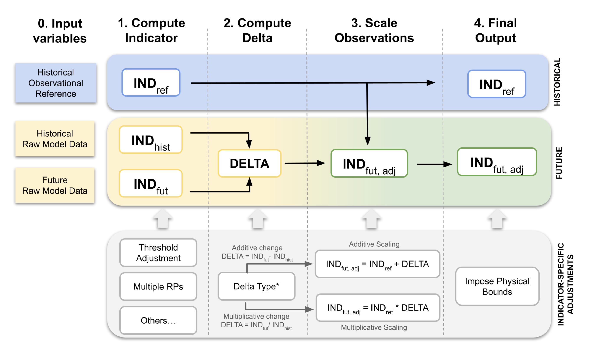

# xids

**xids** is a small, [xarray](https://xarray.dev)-based Python package for the
**Indicator Delta Scaling (IDS)** method. IDS bias-corrects climate indicators
computed from climate model projections, such as CMIP6.

## Goal

Raw climate model output is biased compared with observations. The usual fix is
to bias-adjust the input variables (temperature, precipitation, wind, …) and then
compute indicators from the adjusted variables. That approach is expensive, and
it does not guarantee realistic values for indicators built from several
variables or from extremes.

IDS works on the **indicator** instead of the input variables:

1. Compute the indicator from an observational reference (for example ERA5) for
   a historical period. The result is the "truth" baseline.
2. Compute the same indicator from the raw model for the historical period and
   for one or more future periods.
3. Take the **climate change signal** (the *delta*) from the model only, as the
   difference or ratio between the future and historical model indicators.
4. Apply that delta to the observed baseline.

The result keeps the observed climatology and adds the change projected by the
model. The package works with any indicator function: an `xclim` index, an
`xclim` indicator, or your own function.

## Method



The workflow has four steps. Some indicators also need their own adjustments,
shown in the bottom row of the figure.

| Step | What happens | Indicator-specific options |
|------|--------------|----------------------------|
| **0. Input variables** | Observational reference data (`reference_data`), plus raw model data covering both the historical and future periods (`model_data`). | Single variable or a list/tuple of variables |
| **1. Compute indicator** | The indicator function runs on each period, resampled at `freq`. By default the result is averaged over time. This gives `IND_ref` (observations, historical period), `IND_hist` (model, historical period) and `IND_fut` (model, each future period). | **Threshold adjustment** (`correct_threshold=True`); multiple return periods / extreme-value fits (`aggregation=None`) |
| **2. Compute delta** | The climate change signal from the model: additive, `DELTA = IND_fut − IND_hist`, or multiplicative, `DELTA = IND_fut / IND_hist`. | **Delta type** (`delta_mode='+'` or `'*'`) |
| **3. Scale observations** | Additive scaling, `IND_fut,adj = IND_ref + DELTA`, or multiplicative scaling, `IND_fut,adj = IND_ref × DELTA`. | |
| **4. Final output** | The historical reference `IND_ref` and the adjusted future indicator `IND_fut,adj` for each future period. | **Physical bounds** (for example, cap the multiplicative factor with `delta_factor_limit`) |

As a rule, use additive deltas (`'+'`) for unbounded quantities such as
temperature, FWI or day counts. Use multiplicative deltas (`'*'`) for positive,
ratio-like quantities such as precipitation amounts or wind power density.

## Functionality

### `IndicatorDeltaScaling`

```python
from xids import IndicatorDeltaScaling

ids = IndicatorDeltaScaling(
    hist_period=['1951', '1970'],                        # reference / historical period
    fut_period=[['1971', '1990'], ['1991', '2010']],     # one or several future periods
)
```

#### `ids.compute_indicator(indicator_func, reference_data, model_data, *args, **kwargs)`

Runs the full IDS workflow and returns four `xarray.DataArray`s:

| Output | Description |
|--------|-------------|
| `ind_ref` | Indicator from the observational reference over `hist_period`. |
| `ind_hist` | The same reference indicator, broadcast to the model dimensions (for example `realization`). |
| `ind_fut` | Bias-adjusted future indicator, with a `period` dimension that has one entry per future period. |
| `delta` | Model climate change signal for each future period. For multiplicative mode it is expressed in % by default. |

Main arguments:

| Argument | Default | Description |
|----------|---------|-------------|
| `indicator_func` | — | Any callable that accepts the input variable(s) positionally plus a `freq` keyword, for example `xclim.indices.tx_max` or `xids.indicators.get_dtrx`. |
| `reference_data` / `model_data` | — | A `DataArray`, or a list/tuple of `DataArray`s for multi-variable indicators, passed to `indicator_func` in that order. Both need a `time` dimension. `model_data` must cover the historical and future periods. |
| `delta_mode` | `'+'` | `'+'` for additive, `'*'` for multiplicative delta scaling. |
| `freq` | `'YS'` | Resampling frequency passed to the indicator function. |
| `aggregation` | `'mean'` | `'mean'` averages the indicator over time within each period. Use `None` when the indicator already returns one value per period, for example `xclim.indices.stats.frequency_analysis`. |
| `correct_threshold` | `False` | Adjusts the model threshold to the quantile that the threshold has in the reference data. This matters for threshold indicators such as TX30 or CDD. |
| `delta_factor_limit` | `None` | Upper limit on the multiplicative delta factor. It prevents unrealistic values where the historical indicator is close to zero. |
| `delta_factor_percentage` | `True` | Report multiplicative deltas as % change instead of a factor. |
| `short_name`, `long_name`, `units` | `None` | Metadata attached to the outputs. |
| `compute` | `True` | Load the results into memory. Set it to `False` to keep dask arrays lazy. |
| `**kwargs` | | Passed to `indicator_func`, for example `thresh='30 degC'` or `quantile=0.9`. |

### `xids.indicators`

Ready-to-use indicator functions not available (or not in this form) in `xclim`:

| Function | Indicator |
|----------|-----------|
| `get_windpowerdensity(sfcWind)` | Wind power density, ½·ρ·v³ |
| `get_percentile_value(data, quantile)` | Percentile of a variable within each resampling period, for example FWI 90th percentile |
| `get_drought_sev(spi, threshold)` | Drought severity: sum of SPI below the threshold |
| `get_drought_dur(spi, threshold)` | Drought duration: number of time steps with SPI below the threshold |
| `get_dtrx(tasmax, tasmin)` | Maximum daily temperature range |
| `get_cooldd(tasmin, tas, tasmax, thresh)` | Cooling degree days (Spinoni et al., 2018) |

### `xids.utils`

Helper functions used by the core class: `slice_data`, `unchunk_time`,
`correct_threshold`, `get_quantile_of_value` and `apply_delta_scaling`.

## Installation

The project uses [pixi](https://pixi.sh):

```bash
git clone <repo-url> xids && cd xids
pixi install          # creates the default environment (includes xclim, jupyter, …)
pixi shell            # or use direnv with the provided .envrc
```

Core dependencies are `xarray`, `dask` and `zarr`. `xclim` is needed for
`xids.indicators` and for most of the examples.

## Example: TXx (annual maximum of daily maximum temperature)

This example comes from
[`notebooks/demostration_different_indicators.ipynb`](notebooks/demostration_different_indicators.ipynb).
It uses ERA5 as the observational reference and a CMIP6 ensemble with several
realizations as the model. The notebook covers more indicators: DTRx, RX1day,
RX1day 20-yr return level, TX30, CDD, PRCPTOT, CoolDD, WPD, FWI90p and SPI12
spells/severity.

```python
import xarray as xr
import xclim
from xids import IndicatorDeltaScaling

# --- 0. Input variables --------------------------------------------------
# Observational reference (ERA5), dims: (time, lat, lon)
tasmax_ref = tasmax_hist.sel(source='ref').isel(realization=0).drop_vars('realization')

# Raw model data (CMIP6), historical + future joined along time,
# dims: (realization, time, lat, lon)
tasmax_model = xr.concat(
    [tasmax_hist.sel(source='simu'), tasmax_fut.sel(source='simu')], dim='time'
).chunk({'time': -1})

# --- Configure periods ---------------------------------------------------
ids = IndicatorDeltaScaling(
    hist_period=['1951', '1970'],
    fut_period=[['1971', '1990'], ['1991', '2010']],
)

# --- Steps 1-4: indicator, delta, scaling, output ------------------------
txx_ref, txx_hist, txx_fut, txx_delta = ids.compute_indicator(
    indicator_func=xclim.indices.tx_max,   # any xclim index / custom function
    reference_data=tasmax_ref,
    model_data=tasmax_model,
    freq='YS',                             # annual TXx, then averaged per period
    delta_mode='+',                        # additive change for temperature
    compute=True,
    short_name='txx',
    long_name='Maximum daily maximum temperature',
    units='ºC',
)
```

Inspect the results:

```python
txx_ref.plot()                                    # observed TXx climatology (1951-1970)
txx_delta.plot(col='realization', row='period')   # model change signal per member & period
txx_fut.plot(col='realization', row='period')     # bias-adjusted future TXx = txx_ref + delta
```

`txx_fut` has dimensions `(period, realization, lat, lon)`. Its spatial pattern
comes from the observations and its change signal from each ensemble member.

### Other variations shown in the notebook

```python
# Multi-variable indicator: pass lists in the order the function expects
ids.compute_indicator(indicators.get_dtrx,
                      reference_data=[tasmax_ref, tasmin_ref],
                      model_data=[tasmax_model, tasmin_model], delta_mode='+')

# Multiplicative delta for precipitation, reported as % change
ids.compute_indicator(xclim.indices.max_1day_precipitation_amount,
                      reference_data=pr_ref, model_data=pr_model,
                      delta_mode='*', delta_factor_percentage=True)

# Indicator returning one value per period (20-yr return level): no time averaging
ids.compute_indicator(xclim.indices.stats.frequency_analysis,
                      reference_data=pr_ref, model_data=pr_model,
                      mode='max', t=20, dist='gumbel_r', method='ML',
                      aggregation=None, delta_mode='*')

# Cap unrealistic multiplicative factors (physical bounds)
ids.compute_indicator(indicators.get_windpowerdensity,
                      reference_data=wind_ref, model_data=wind_model,
                      delta_mode='*', delta_factor_limit=5)
```

## Authors

- Suso Peña ([@susopeiz](mailto:susopeiz@gmail.com))
- Sascha Hofmann ([@saschahofmann](mailto:sascha.kelevra@gmail.com))
